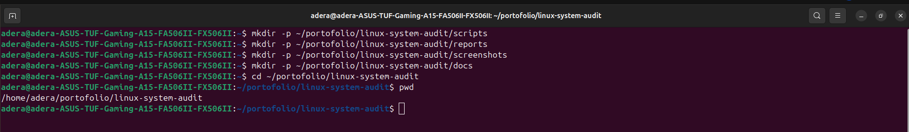
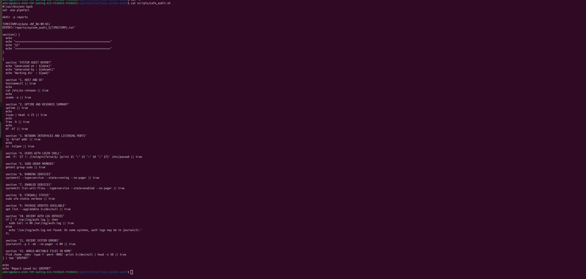
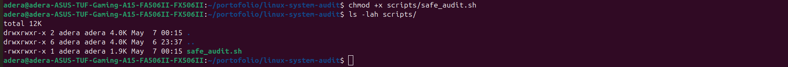
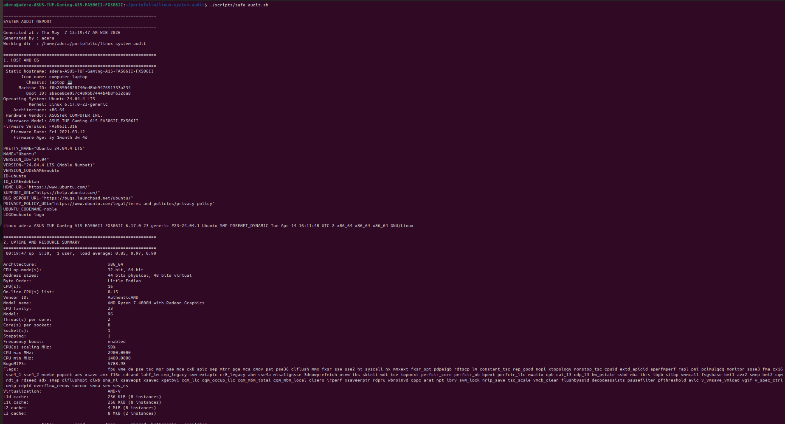
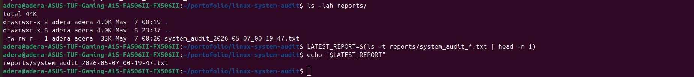
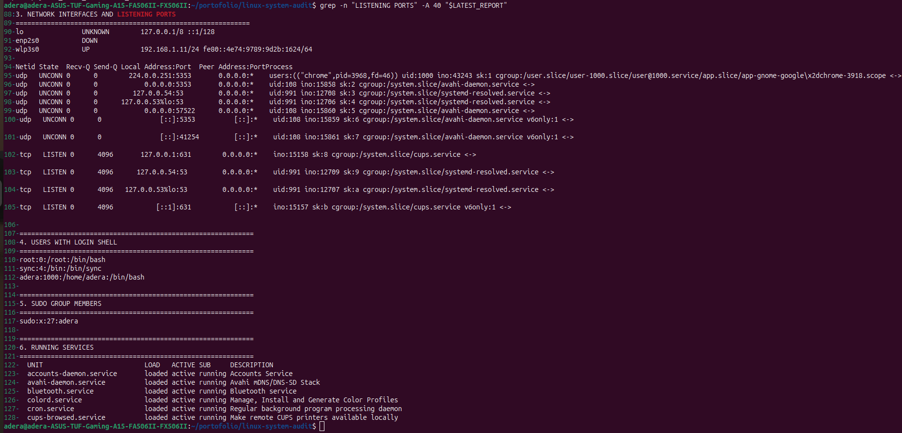
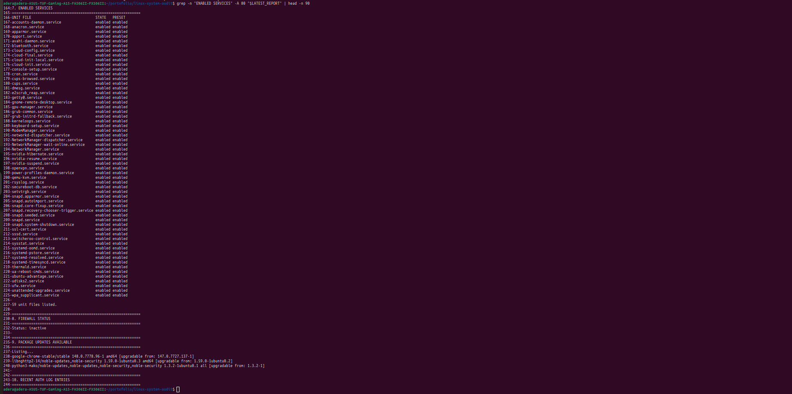
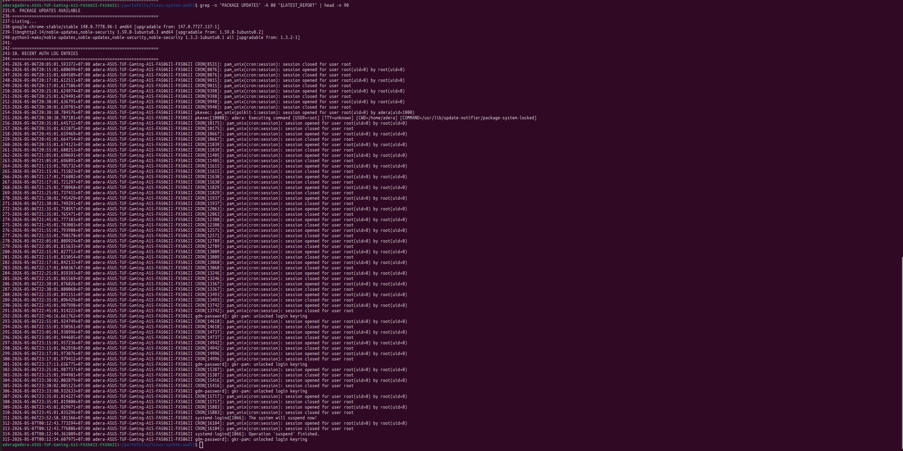
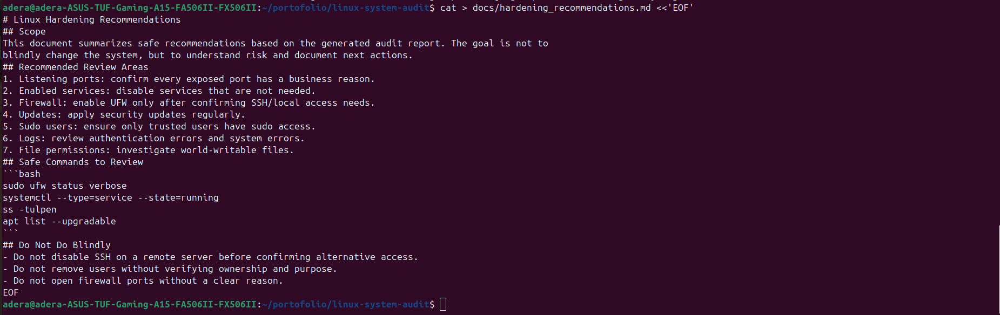
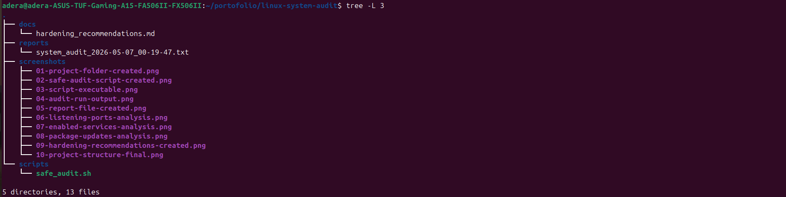

# Linux System Audit & Hardening Report

## Project Overview

This project is a Linux system audit and basic hardening portfolio project built on Ubuntu Linux.

The purpose of this project is to collect important system information, analyze basic security conditions, and document hardening recommendations in a structured way.

This project demonstrates beginner-friendly Cloud Engineer and Linux Administrator skills, including Bash scripting, Linux command usage, system auditing, security awareness, documentation, Git, and GitHub portfolio management.

---

## Project Objectives

The objectives of this project are:

1. Create a Bash script to perform a basic Linux system audit.
2. Generate an audit report automatically.
3. Analyze listening ports, enabled services, package updates, and system information.
4. Write hardening recommendations based on the audit result.
5. Organize the project into a clean GitHub repository structure.
6. Provide screenshots as portfolio evidence.

---

## Tools Used

| Tool | Purpose |
|---|---|
| Ubuntu Linux | Operating system used for the project |
| Bash / Shell Script | Used to automate audit commands |
| systemctl | Used to inspect enabled services |
| ss | Used to inspect listening ports |
| apt | Used to check package updates |
| Git | Used for version control |
| GitHub | Used to publish the portfolio project |
| nano | Used to create and edit project files |

---

## Project Structure

```text
linux-system-audit/
├── docs
│   └── hardening_recommendations.md
├── reports
│   └── system_audit_2026-05-07_00-19-47.txt
├── screenshots
│   ├── 01-project-folder-created.png
│   ├── 02-safe-audit-script-created.png
│   ├── 03-script-executable.png
│   ├── 04-audit-run-output.png
│   ├── 05-report-file-created.png
│   ├── 06-listening-ports-analysis.png
│   ├── 07-enabled-services-analysis.png
│   ├── 08-package-updates-analysis.png
│   ├── 09-hardening-recommendations-created.png
│   └── 10-project-structure-final.png
└── scripts
    └── safe_audit.sh
```

---

## Main Script

The audit script is located in:

```bash
scripts/safe_audit.sh
```

The script automatically generates an audit report inside the `reports/` directory.

Example generated report:

```bash
reports/system_audit_2026-05-07_00-19-47.txt
```

---

## What the Script Checks

The script collects several types of system information, including:

- System identity
- Operating system information
- Kernel version
- Disk usage
- Memory usage
- Listening network ports
- Enabled services
- Available package updates
- Basic security observations

---

## How to Run This Project

### 1. Clone the repository

```bash
git clone https://github.com/adhelia2027-koboy/linux-system-audit.git
```

### 2. Enter the project directory

```bash
cd linux-system-audit
```

### 3. Make the script executable

```bash
chmod +x scripts/safe_audit.sh
```

### 4. Run the audit script

```bash
./scripts/safe_audit.sh
```

### 5. Check the generated report

```bash
ls -lh reports/
```

### 6. Open the latest report

```bash
LATEST_REPORT=$(ls -t reports/system_audit_*.txt | head -n 1)
less "$LATEST_REPORT"
```

---

## Example Audit Commands

### Check Listening Ports

```bash
ss -tuln
```

This command is used to display TCP and UDP ports that are currently listening on the system.

### Check Enabled Services

```bash
systemctl list-unit-files --type=service --state=enabled
```

This command is used to identify services that automatically start when the system boots.

### Check Available Package Updates

```bash
apt list --upgradable
```

This command is used to identify packages that have available updates.

---

## Hardening Recommendations

The hardening recommendation document is located in:

```bash
docs/hardening_recommendations.md
```

The recommendations include:

- Review enabled services regularly
- Disable unnecessary services
- Keep the system updated
- Monitor listening ports
- Apply the principle of least privilege
- Review audit reports periodically
- Avoid exposing unnecessary services to the internet

---

## Screenshots

The screenshots are stored in the `screenshots/` directory.

| No | Screenshot | Description |
|---|---|---|
| 01 | `01-project-folder-created.png` | Project folder creation |
| 02 | `02-safe-audit-script-created.png` | Bash audit script creation |
| 03 | `03-script-executable.png` | Script permission changed to executable |
| 04 | `04-audit-run-output.png` | Audit script execution |
| 05 | `05-report-file-created.png` | Audit report generated |
| 06 | `06-listening-ports-analysis.png` | Listening ports analysis |
| 07 | `07-enabled-services-analysis.png` | Enabled services analysis |
| 08 | `08-package-updates-analysis.png` | Package update analysis |
| 09 | `09-hardening-recommendations-created.png` | Hardening recommendation document |
| 10 | `10-project-structure-final.png` | Final project structure |

---

## Screenshot Preview

### Project Folder Created



### Safe Audit Script Created



### Script Executable Permission



### Audit Run Output



### Report File Created



### Listening Ports Analysis



### Enabled Services Analysis



### Package Updates Analysis



### Hardening Recommendations Created



### Final Project Structure



---

## Key Lessons Learned

Through this project, I learned how to:

- Organize a Linux audit project properly
- Write a basic Bash script for automation
- Use Linux commands to inspect system status
- Understand enabled services and listening ports
- Generate audit reports automatically
- Document security recommendations
- Prepare a GitHub repository for portfolio purposes

This project helped me understand that system auditing is not only about running commands. It is also about reading the result, identifying potential risks, and turning the findings into actionable hardening recommendations.

---

## Future Improvements

Possible improvements for this project:

- Add log analysis from `/var/log`
- Add failed login attempt detection
- Add firewall status checking using `ufw`
- Add SSH configuration audit
- Add automatic risk summary
- Export the audit result to Markdown or HTML
- Create a scheduled audit using cron

---

## Author

**Ade Rahmat Taufik**  
Cloud Engineering Learner  
GitHub: [adhelia2027-koboy](https://github.com/adhelia2027-koboy)

---

## Portfolio Note

This project is part of my Cloud Engineering learning journey.

It demonstrates basic Linux administration, Bash scripting, system auditing, security hardening awareness, documentation, and GitHub portfolio preparation.
